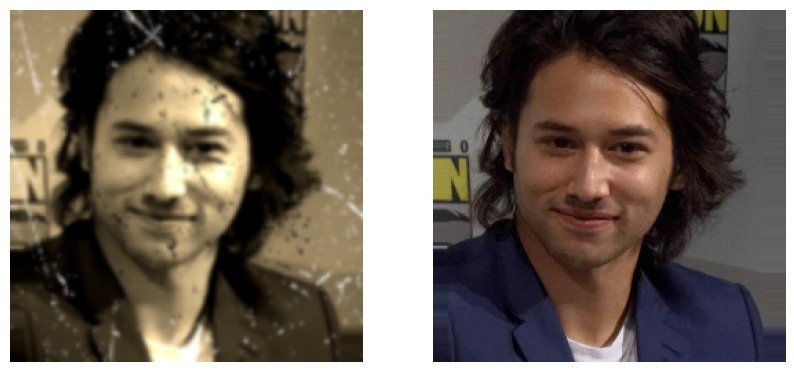
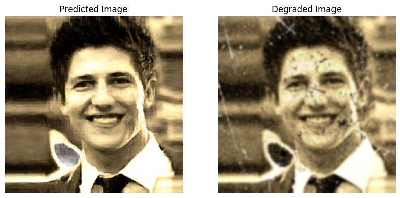
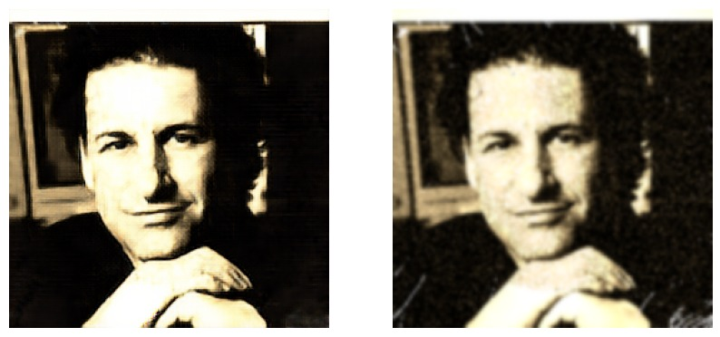
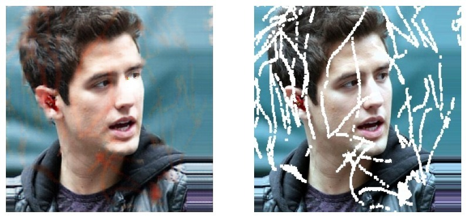
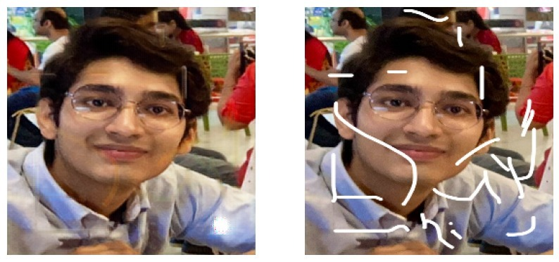

# Photo-Restoration

Welcome to the Photo Restoration and Image Inpainting Removal project! This tool effortlessly enhances the quality of degraded old image and removes artifacts, perfect for preserving cherished memories. With intuitive functionality, it brings new life to old photographs, ensuring they remain vivid for generations to come..

## Generating Synthetic Images (Dataset Preparation)

**Sample Image** 

## Restoration Images

**Sample Image** 

 

## Impainting Images

**Sample Image** 

 

## Installation

### Requirements.txt

1. Clone the repository: `git clone https://github.com/pranay-009/Photo-Restoration.git`
2. Navigate to the project directory: `cd Photo-Restoration`
3. Install dependencies using pip: `pip install -r requirements.txt`

## Dataset
We used a Kaggle dataset for our project for bothe impainting and Old-Photo Restoration tasks. Although we have synthesized the dataset for the photo restoraton solution you can use our processing technique for regenerating the old images 

[You can refer to the dataset here](https://www.kaggle.com/datasets/bharatadhikari/humanface8000)

## License

This project is licensed under the [MIT License](LICENSE). Feel free to use, modify, and distribute it as needed.